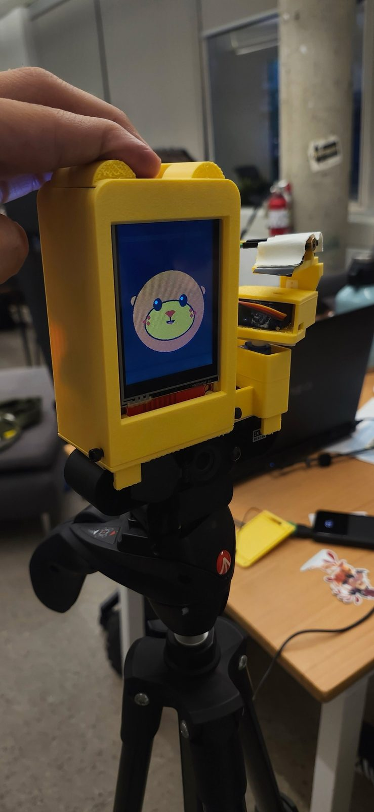
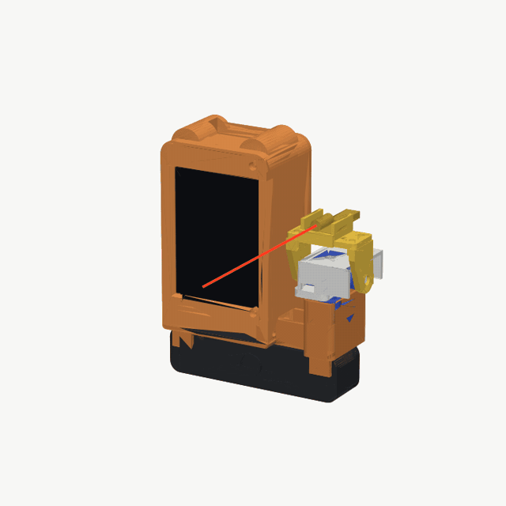
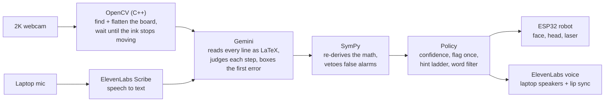

# Otter Tutor

**A desk robot that watches you solve math on a whiteboard, points a laser at the line where you went wrong, and tells you what kind of slip it is, without ever giving you the answer.**

Built in 24 hours at **StormHacks 2026** (SFU Burnaby, Oct 3–4) by Leandro, Sebas, Chris and Allen.

<p align="center">
  
  &nbsp;
  
</p>

## What it does

You solve a problem by hand on a real whiteboard. A webcam watches the board, and when you stop writing the otter checks every line:

- **Spots the first wrong line** and sorts it: wrong rule, rule applied incorrectly, or an arithmetic slip.
- **Points a laser at that line**, makes a confused face, and says out loud what you were doing there: *"Check how you took the derivative on line 1."*
- **Gets more specific only if you need it.** Ask again, keep writing with the mistake still there, or stay stuck for a minute, and you get one more precise hint: *"Look at what happened to the x when you took the derivative on line 1."*
- **Never gives the fix.** No rule names, no corrected math, no answer. A word filter enforces this on everything it says.
- **Talks with you.** Tap a key and ask a question out loud ("is line 2 right?", "what does a derivative mean?"). It answers by the same rules, looking at your board.
- **Praises correct work** once, then stays quiet so it never nags.

## How it works



| Stage | What happens |
|---|---|
| **Vision** (`brain/vision/`, C++ via pybind11) | Finds the whiteboard, deskews it, and measures change between frames. A check only starts when something new is on the board and nothing has moved for 5 s, at most once every 5 s. |
| **Gemini** (`brain/gemini_brain.py`) | Returns structured JSON: each line in LaTeX, a verdict (`ok`, `wrong_rule`, `misapplied`, `arithmetic`, `unclear`), a bounding box, a first hint, a second hint, and a reply if the student spoke. Falls back through several Flash models and rotates API keys when one is overloaded or out of quota. |
| **SymPy** (`brain/verifier.py`) | Re-checks derivatives, integrals, algebra, trig identities and plain arithmetic. If Gemini flags a line that SymPy proves correct, the otter stays quiet: a false alarm is worse than a miss. |
| **Policy** (`brain/policy.py`) | Speaks only at confidence ≥ 0.70, flags each mistake once, waits 20 s between nudges, and runs the two-step hint ladder. Anything that names a rule or contains corrected math is replaced with a safe sentence. |
| **Robot** (`otter-robot-arduino/`) | The laptop sends JSON over a WebSocket (`face`, `mouth`, `look`, `laser`, `home`). The ESP32 draws the otter's six moods, turns the head, and lights the laser only once the head has arrived on the line. |
| **Voice** (`brain/voice.py`, `brain/audio.py`) | ElevenLabs speech plays on the laptop speakers while the otter's mouth follows the real loudness of the voice. Questions are recorded on the laptop's own mic and transcribed by ElevenLabs Scribe. |

## Hardware

- **ESP32** DevKit, talking to the laptop over Wi-Fi (firmware updates over the air)
- **2.8" ILI9341** screen, portrait 240×320, showing the otter (idle, listening, thinking, talking, happy, confused)
- **2× SG90 servos** for pan (±60°) and tilt (−40° to +15°, so the laser stays below eye level)
- **KY-008 laser** in the otter's hand, with a 6 s safety cut-off in firmware
- **2K USB webcam** for the board; the laptop's **mic and speakers** for the voice
- **3D-printed body**, seven parts, designed in CAD so the arm never hits the body

| Part | ESP32 pin |
|---|---|
| Pan servo | GPIO 25 |
| Tilt servo | GPIO 26 |
| Laser | GPIO 27 (active-low) |
| Screen (SPI) | MOSI 23 · SCLK 18 · MISO 19 · CS 5 · DC 16 · RST 17 |

## Repository layout

| Path | Contents |
|---|---|
| [`brain/`](brain/) | The laptop "brain": FastAPI server, Gemini, SymPy verifier, policy, voice, camera, test tools. Details in [brain/README.md](brain/README.md). |
| [`brain/vision/`](brain/vision/) | C++ OpenCV module (board detection, deskew, change score), with a pure-Python fallback. |
| [`otter-robot-arduino/`](otter-robot-arduino/) | ESP32 firmware (Arduino): otter face, servos, laser, Wi-Fi, OTA updates. |
| [`website/`](website/) | The project website: plain HTML/CSS/JS with an interactive demo, published with Netlify (`netlify.toml`). |
| [`docs/GAMEPLAN.md`](docs/GAMEPLAN.md) | The original plan: roles, message contracts, timeline. |
| [`COMMANDS.txt`](COMMANDS.txt) | Every command to run, test, flash and troubleshoot the robot. |

## Run it

You need Python 3.12, a Gemini API key, and (for the voice) an ElevenLabs API key.

```bash
git clone https://github.com/ChrisColbourne/Hackathon26-.git && cd Hackathon26-
python3 -m venv .venv && source .venv/bin/activate
pip install -r brain/requirements.txt
cp .env.example .env              # add GEMINI_API_KEY and ELEVENLABS_API_KEY
brain/vision/build.sh             # optional: build the C++ vision module (needs OpenCV dev + CMake)

python -m brain.server --show     # webcam preview + the full pipeline
```

In the preview window: **c** checks the board now, **t** talks to the otter, **p** pauses automatic checks, **b** toggles board detection, **q** quits.

- **No API quota?** `GEMINI_MOCK=1 python -m brain.server --show` uses canned verdicts.
- **No robot?** Everything runs anyway; robot commands are logged instead of sent.
- **The robot:** copy `otter-robot-arduino/otter_robot/secrets.example.h` to `secrets.h`, add your Wi-Fi and the laptop's IP, then flash with `./otter-robot-arduino/flash.sh` (USB) or `./otter-robot-arduino/flash.sh ota` (Wi-Fi). It connects to the brain by itself.
- **Hardware checks:** `python -m brain.tools.face_test`, `robot_test`, `voice_test` and `calibrate_laser` (aims the laser at the board's corners). See [COMMANDS.txt](COMMANDS.txt) for all of them.

## Built with

Gemini API · ElevenLabs (text to speech + Scribe speech to text) · OpenCV (C++ / pybind11) · SymPy · Python + FastAPI + WebSockets · ESP32 (Arduino, TFT_eSPI, ESP32Servo, ArduinoJson) · .tech domain · Netlify

## Team

| | |
|---|---|
| **Chris** | The brain: Gemini vision, the SymPy check, the nudge policy and the laptop server |
| **Sebas** | CAD and the 3D-printed body and arm, plus much of the electronics |
| **Leandro** | Hardware: electronics, wiring and firmware |
| **Allen** | Hardware: electronics, wiring and firmware |
